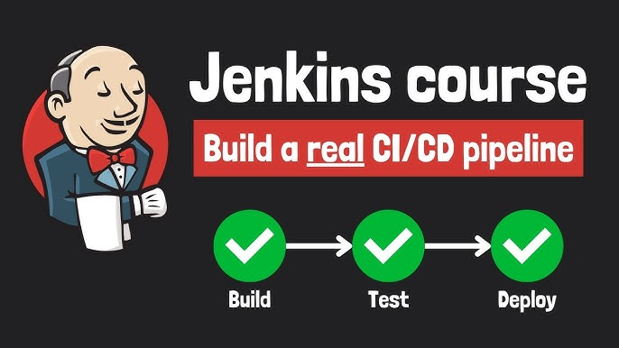

# Jenkins Roadmap - From Beginner to Expert

> A complete hands-on roadmap to master Jenkins through real-world projects, best practices, and CI/CD pipelines.

## 📖 About

This repository is my complete learning journey for **Jenkins**.

Instead of collecting notes, this repository is designed as a **practical portfolio**, where every chapter introduces a new concept and demonstrates it through working examples.

The objective is to progress from a simple **Hello World Pipeline** to building a complete enterprise-grade CI/CD platform.

Every example is fully executable and follows industry best practices.

---

# 🎯 Objectives

By the end of this roadmap, I will be able to:

* Install and configure Jenkins
* Write Declarative and Scripted Pipelines
* Integrate Jenkins with Git & GitHub
* Build Java/Spring Boot applications
* Execute automated tests
* Build Docker images
* Deploy applications automatically
* Manage secrets and credentials
* Use distributed Jenkins agents
* Create reusable Shared Libraries
* Integrate code quality tools
* Build production-ready CI/CD pipelines

---

Each chapter contains:

* 📘 Documentation
* 💻 Source code
* 📄 Jenkinsfile
* 📷 Screenshots (when relevant)
* ✅ Final result

---

# 🛠 Technologies

* Jenkins
* Git
* GitHub
* Linux
* Bash
* Java
* Maven
* Gradle
* Docker
* Docker Compose
* Spring Boot

# 🎓 Learning Philosophy

This repository follows one simple principle:

> **Learn by building.**

Every concept is introduced through a practical project before moving on to more advanced topics.

No theoretical chapter exists without an executable example.
---

# 🌟 Related Roadmaps

This repository is part of a larger DevOps learning journey.

Planned repositories:

* Kubernetes Roadmap
* Helm Roadmap
* Terraform Roadmap
* Ansible Roadmap
* ArgoCD Roadmap
* Prometheus Roadmap
* Grafana Roadmap
* Git & GitHub Roadmap

---

## ⭐ Support

If you find this repository useful, consider giving it a ⭐ on GitHub.

It motivates me to continue building high-quality educational DevOps content.
